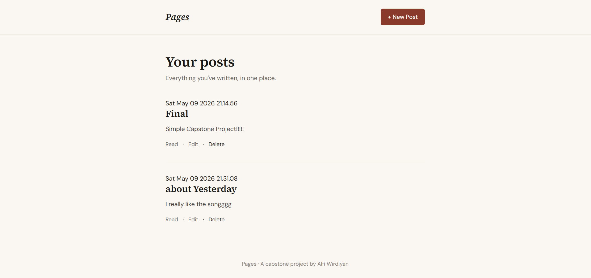

# Pages — A Simple Blog

A minimalist blog application built with Node.js and Express as a capstone project for learning full-stack web development.

## Features

- Create new blog posts
- Read individual posts
- Edit existing posts
- Delete posts
- Data persisted to a local JSON file (survives server restarts)

## Tech Stack

- **Runtime:** Node.js
- **Framework:** Express.js
- **Templating:** EJS
- **Storage:** JSON file (`posts.json`)
- **Styling:** Custom CSS with Google Fonts

## Project Structure

```
├── public/
│   └── styles/
│       └── style.css
├── views/
│   ├── partials/
│   │   ├── header.ejs
│   │   └── footer.ejs
│   ├── index.ejs
│   ├── post.ejs
│   ├── create.ejs
│   └── edit.ejs
├── index.js
├── package.json
└── .gitignore
```

## Getting Started

### Prerequisites

- Node.js v18+

### Installation

```bash
git clone https://github.com/alfiqore/pages-blog.git
cd nama-repo
npm install
```

### Running the app

```bash
node index.js
```

Open your browser and go to `http://localhost:3000`

## Routes

| Method | Route | Description |
|--------|-------|-------------|
| GET | `/` | Home — list all posts |
| GET | `/create` | Form to create a new post |
| POST | `/create` | Save new post |
| GET | `/post/:id` | View a single post |
| GET | `/edit/:id` | Form to edit a post |
| POST | `/edit/:id` | Save edited post |
| POST | `/delete/:id` | Delete a post |

## Notes

- Posts are stored in `posts.json` and excluded from version control via `.gitignore`
- This project uses ES Modules (`"type": "module"` in `package.json`)
